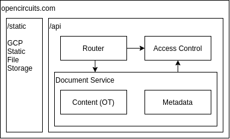

# Backend Architecture
The new design involves six main components split across several services.  Some components may be a separate service, potentially written in a different language.  The redesign breaks off the serving of static files from dynamic site features.  GCP should support this kind of basic routing, but the router can support static files as a fallback:
- `/static`: points to static files
-	`/api`: points to dynamic features



## Router
This component has two responsibilities
1. Verify the identity of the sender
2. Route requests to appropriate services

Subsequent components can assume the identity of the sender is correct

## Access Control
This component stores the authorization information for circuits and users.  This is separate from the Document Service for future flexibility of user groups and group permission control that is independent of individual documents.

There will be two different kinds of access initially:
1. Per-user permission: 
```go
type UserPermission struct{
	UserId      string
	CircuitId   string
	AccessLevel int
	Expiration  time.Time
}
``` 
2. Per-link permission:
```go
type LinkPermission struct{
	LinkId      string
	CircuitId   string
	AccessLevel int
	Expiration  time.Time
}
``` 

The `LinkId` is used identically to the `CircuitId` and anonymizes the circuit from the users.  This allows share links to be revocable and the owner can generate new ones on demand.  These are translated in the routing layer of the Document Service.

Each circuit has a list of `UserPermission`s and `LinkPermission`s and potentially some extra per-circuit data, like an `isPublic` flag used in a future public catelog feature.

### Storage
The production environment will use GCP Firestore in Datastore mode.  This provides strong consistency at the expense of write performance, but Access will be read-dominated so it's OK.  The development environment will be MongoDB.  The `UserPermission` and `LinkPermission` types map well to the NoSQL model.

### Interface
The interface for the access subsystem, whether in-process or proxied, provides a set of capabilities for both editing the permissions of the circuits and for checking access.  `error`s will be from insufficient permission - internal errors will be `panic`s that induce 500-type errors.

This provides standard operations on permission types and is used by the front-end permission editor.
```go
type DataDriver interface {
	GetCircuit(circuitId CircuitId) (CircuitPermissions, error)
	GetCircuitUser(circuitId CircuitId, userId UserId) (UserPermission, error)
	GetLink(linkId LinkId) (LinkPermission, error)

	UpsertCircuit(perms CircuitPermissions) error
	UpsertCircuitUser(perm UserPermission) error
	UpsertCircuitLink(perm LinkPermission) (LinkPermission, error)

	DeleteCircuit(circuitId CircuitId) error
	DeleteCircuitUser(circuitId CircuitId, userId UserId) error
	DeleteLink(linkId LinkId) error
}
```

This driver provides permission checks on a per-user / per-circuit basis.  It is an internal interface used by the Document Service to verify operations.  Operations that take `LinkId` decode it as well.
```go
type AccessCheckDriver interface {
	TryView(CircuitId, UserId) error
	TryView(LinkId) (CircuitId, error)

	TryEdit(CircuitId, UserId) error
	TryEdit(LinkId, UserId) (CircuitId, error)

	TryDelete(CircuitId, UserId) error
}
```

### Access Levels
To compromise between complexity and features there will be four levels of access.

**TODO: Workshop this list**
1. No Access
2. View Access
	- View existing view-only share links
	- Extend view permission to other users
3. Edit Access
	- View existing edit share links
	- Extend edit permission to other users
4. Owner (exactly one)
	- Can create/revoke all user and link permissions
	- Can transfer ownership to another user - eventually

## Document Service
This service encompasses all document-level operations.  It initializes WebSocket connections with the Contents (OT) component, verifices authorization via Access Control, and manages metadata for circuits.  

## Metadata
The metadata is included adjacent to the primary data in the current schema, like:
```go
type CircuitMetadata struct {
	ID        CircuitId
	Name      string
	Owner     UserId
	Desc      string
	Thumbnail string
	Version   string
}
```
The `ID`, which is a randomly-generated string, uniquely identifies a circuit.

The `Thumbnail`, which is a b64-encoded image, needs to be replaced somehow because the clients will not be providing updated thumbnails for every edit operation.  These can be generated on-demand with a dedicated thumbnail rendering subsystem (i.e. `/thumbnail/<circuit-id>`) that uses the existing TypeScript logic.

The `Owner` field is deprecated by the Access System, so it should be removed.  It may still be useful to know the owner.

The `Version` field refers to the version of the schema that is used.  This will remain and continue to be used to update old circuits to new schemas.  This refers to the accumulated document, not the OT log, so accumulated documents will be migrated on-demand if the schema version in the database does not match the running version.  Old versions of the circuit, pre-migration, should be kept for safety.

The `Name` and `Desc` fields _are_ metadata, but it would be good to include them in OT as a top-level property of the circuit since they are user-editable.  This avoids all out-of-band communication for document edits.

### Is Metadata Needed?
The metadata will still be saved like before in the document, but with these fields removed
- `Thumbnail` uses an external service
- `Owner` uses the Access Service

This data _is_ needed, but it is only ever all needed at the same time for rendering the circuit list on the left side-bar.  The Metadata component of the Document Service will collect these fields and return them to the front-end when requested.

## Content (OT)
The heart of multi-user editing is the Operational Transformation (OT) system.  The details will follow, but in general it will be a custom OT method that operates on a Graph data-structure that fits the needs of OpenCircuits.

There are two main concepts:
- The log: composed of temporary entries, represents individual OT operations on the circuit.  A cache used to resolve concurrent operations
- The document: the accumulated circuit from all entries.  Entries are applied to the document

### Communication
This subsystem manages a set of WebSocket connections with clients.  Each authorized client gets its own secret `SessionID`, which is part of the WebSocket connection URL, used to route requests.  The initial implementation can expire `SessionID`s when the connection closes or after a fixed inactivity time to avoid storing them indefinitely.  These are only stored in memory.

The protocol includes several types of information:
1. Operational Transformation Entries
1. Information about Other Users: Allow the user to see what the other users have selected
2. Simulation State: Synchronize all users' simulation timing

Initially only (1.) will be implemented.  (2.) and (3.) can be added at a later time.

### Authorization
We want access revocation to happen immediately.  For simplicity, each operation will be authorized via the Access System.

This is inefficient since editing is a sequence of many small, incremental changes.  A later system can use pre-authorized `SessionID`s that are revoked when access changes.

### Concurrency
I intend on using Go to implement the back-end OT system because of its concurrency model and I have written distributed systems in Go before.  Each document will have its own `goroutine` and the routing layer will attach an identity to requests before sending it via a `chan`nel.

### Storage
The log and the document have different storage needs.  The document can change relatively infrequently (i.e. max once per 5 seconds), but the log is constantly having entries added.  Since the concurrency model has one thread per document, all accesses to the storage system for a single document will be done by one thread.

For the document, a strongly consistent model should be used so that log entries can be deleted once the write is successful.  However, the size of the document contents is not bounded.  There will be multiple documents with the same circuit ID in the case of migrations, so the Key for the document is not the same as the circuit id.

For the log, strong consistency is still desireable, but entries are added rapidly and removed periodically.  Entries are never editted (the total order is determined in-memory).

For both of these use-cases, the "GCP Firstore in Datastore mode" is a good candidate.  The caveat is that the document can be large and entries are limited to 1MB on GCP.  This means the document contents need to be multi-part.  The reduced write rate with strong consistency is per entry, so multi-part documents do not pose a problem.

For developer machines, MongoDB can be used.

### Language
Since the OT system needs to be implemented on both the front-end and the back-end, there are some shared operations.  The back-end logic is more complex for managing the log since it can have multiple clients connected.  I do no think there will be significant overlap in the back-end / front-end log management for it to be worth using WASM or writing the back-end component in TypeScript.

Since we want the back-end to trim the log and accumulate a full base documet that it can serve to the client, both the front-end and back-end must have identical accumulate logic.  There are a few options:
1. Write in Go and TypeScript
	- BAD: inevitable inconsistencies
1. WASM the Go code
	- Not great: front-end needs strongly-typed access
1. WASM the TypeScript code (AssemblyScript + Wasmer)
	- Subset of TypeScript
	- No windows support (fine ...maybe)
1. Create an internal back-end service in TypeScript
	- Communication overhead + frequency?
		- Limit to every 5 seconds max
	- This can also render the `Thumbnail`
